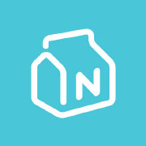

<h1 align="center">NextDay 101</h1>

期待每一天~~生活很沉闷，但跑起来就有风

    
    
    

## 介绍

 本项目是 NextDay101 的开源版本，保留了部分无需云开发的功能，正式版如下

## 预览

### GIF动态

### 截图

## 开发

申请 PartnerName 和 Partner Secret 后，修改 `config-index.js` 中的 partnerName 和 PartnerKey 

## 其他

Q：如何跑通该项目？

A：首先要去前往 [NextDay 官方授权](https://github.com/NXMIX/nextday-public-api) 地址，申请 Partner Secret，其次在微信开发者工具的-详情-本地设置中，将「 不检验合法域名、web-view（业务域名）、TLS版本以及 HTTPS 证书」打上勾，如此即可

Q：我可以参与开发 NextDay101 吗？

A：当然可以，随时欢迎提交PR

Q：我能给 NextDay101 提新功能吗？

A：Issues 区随时欢迎你

Q：NextDay101的主要技术栈是什么？

A：原生小程序语言开发

## License

MIT